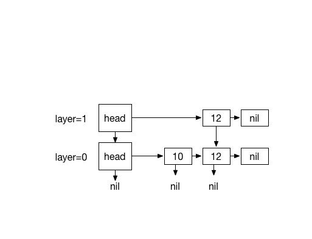
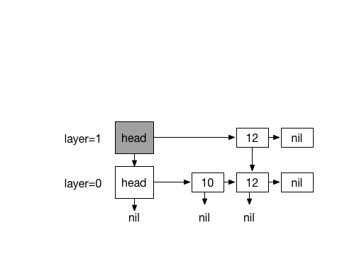
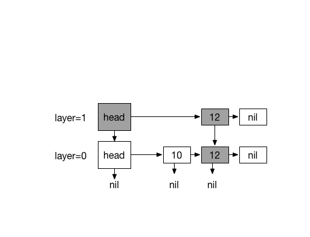
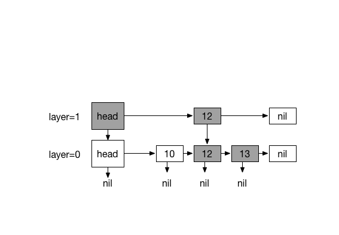

# Skip List

Skip List는 AVL / Red-Black 트리와 같은 로그 시간만큼의 효율성을 가진 확률적인 데이터 구조이며 검색 및 업데이트 작업을 효율적으로 지원하며  다른 데이터 구조와 비교하여 구현하기가 비교적 간단합니다.

Skip List S는 일련의 정렬 된 연결리스트{L0, ..., Ln}, 계층화 된 Layer로 구성되며 각 계층 L은 계층 L0에있는 항목의 하위 집합을 증분 순서로 저장합니다. 계층 {L1, ..., Ln}의 항목은 확률 1/2로 동전 뒤집기 기능을 기반으로 무작위로 선택됩니다. 순회의 경우 계층의 모든 항목은 아래 노드와 다음 노드를 참조 합니다. 이 계층은 그 아래의 계층에 대해 고속 차선 역할을하므로 레인을 건너뛰고 이동 거리를 줄이고 정기적 인 링크 목록에서 예상대로 O (n)을 검색하는 등 빠른 O (log n) 검색이 가능합니다.

For a skip list *S*:

리스트 L0에는 삽입 된 모든 item이 포함됩니다.
리스트 {L1, ..., Ln}에 대하여, Li는 Li-1에서 임의로 생성 된 리스트의 부분 집합을 포함합니다.
높이는 동전 뒤집기로 결정됩니다

Figure 1

#Searching

Searching for  element *N* starts by  traversing from top most  layer *Ln* until
*L0*.

Our objective  is to find an  element *K* such  that its value at  the rightmost
position of current layer, is less-than  target item and its subsequent node has
a greater-equal  value or nil (  *K.key < N.key  <= (K.next.key or nil)*  ). if
value of *K.next* is equal to *N*,  search is terminated and we return *K.next*,
otherwise drop underneath using *K.down* to the node below ( at layer Ln-1 ) and
repeat the process until *L0* where *K.down* is `nil` which indicates that level
is *L0* and item doesn't exists.

###Example:

#Inserting

Inserting  element  *N*  has  a  similar process  as  searching.  It  starts  by
traversing from  top most layer *Ln*  until *L0*. We  need to keep track  of our
traversal path  using a  stack. It  helps us  to traverse  the path  upward when
coin-flipping starts, so we can insert  our new element and update references to
it.

Our objective  is to find  a element  *K* such that  its value at  the rightmost
position of  layer *Ln*,  is less-than new  item and its  subsequent node  has a
greater-equal value  or nil (  *K.key  < N.key <  (K.next.key or nil)*  ). Push
element *K*  to the stack and  with element *K*,  go down using *K.down*  to the
node below  ( at layer Ln-1  ) and repeat the  process ( forward searching  ) up
until  *L0* where  *K.down* is  `nil`  which indicates  that level  is *L0*.  We
terminate the process when *K.down* is nil.

At *L0*, *N* can be inserted after *K*.

Here is the  interesting part. We use coin flipping  function to randomly create
layers.

When  coin flip  function returns  0,  the whole  process is  finished but  when
returns 1, there are two possibilities:

1. Stack is empty ( Level is *L0* /- *Ln* or at uninitialized stage)
2. Stack has items ( traversing upward is possible )

In case 1:

A new layer M*  is created with a head node *NM* referencing  head node of layer
below  and *NM.next*  referencing new  element *N*.  New element  *N* referecing
element *N* at previous layer.

In case 2:

repeat until stack is empty Pop an item *F* from stack and update the references
accordingly.  *F.next* will be *K.next* and *K.next* will be *F*
	
when  stack  is  empty Create  a  new  layer  consisintg  of a  head  node  *NM*
referencing  head node  of layer  below  and *NM.next*  referencing new  element
*N*. New element *N* referencing element *N* at previous layer.
		 

###Example:

Inserting 13. with coin flips (0)

Inserting 20. with 4 times coin flips (1) 

#Removing

Removing works similar to insert procedure.

TODO

#See also

[Skip List on Wikipedia](https://en.wikipedia.org/wiki/Skip_list) 

Written for Swift Algorithm Club by [Mike Taghavi](https://github.com/mitghi)
